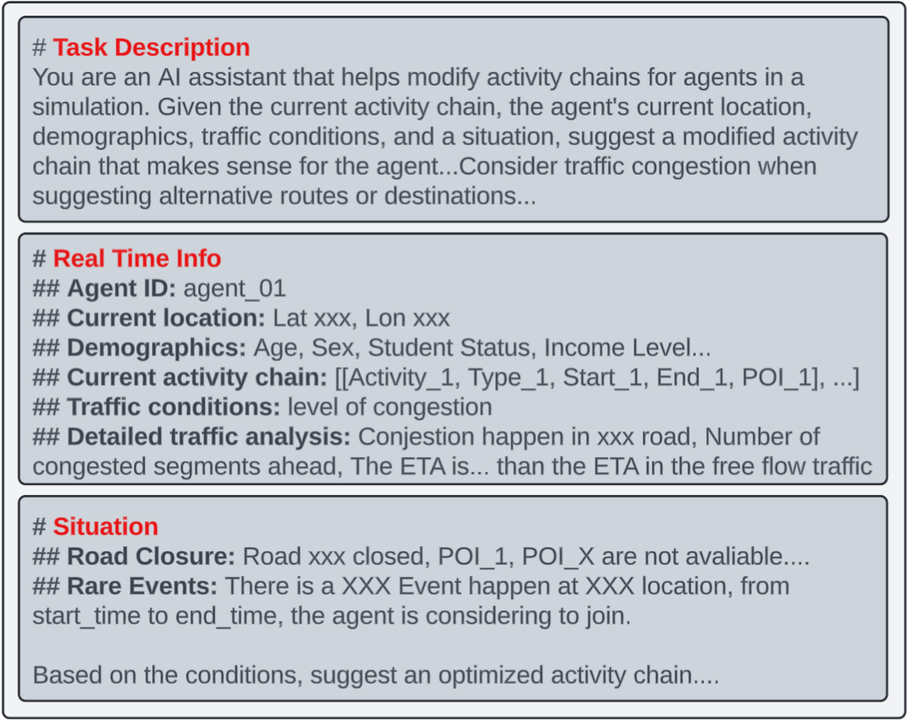

# MobiVerse: Scaling Urban Mobility Simulation with Hybrid Lightweight Domain-Specific Generator and Large Language Models [[Paper Link]](https://arxiv.org/abs/2506.21784)


## Demo Video
[](resources/videos/mobiverse_demo.mp4)

## Overview

MobiVerse is an advanced urban mobility simulation platform that integrates Large Language Models (LLMs) with transportation simulation to enable realistic human mobility decision-making at scale. The platform addresses critical limitations in existing mobility simulation approaches by providing a flexible framework that supports various activity and decision generation methods while incorporating LLM-powered behavioral adaptation. MobiVerse serves as a comprehensive research platform where users can integrate their own mobility modeling algorithms and test them with dynamic behavioral adaptation capabilities, enabling scalable simulations of large numbers of agents at city- and region-scale that can respond to environmental feedback in real time.

<div align="center">

</div>

<div align="center">
<em>Figure 1: MobiVerse system overview showing interactive route modification, simulation environment, and real-time agent monitoring</em>
</div>

### Key Features

#### **Intelligent AI Agents**
- Unlike traditional agent-based models, MobiVerse features LLM- and domain-specific generator-powered agents with vivid, human-like decision-making capabilities
- Agents autonomously adapt behavior based on highly complex contextual understanding and real-world reasoning, not possible with traditional statistical behavoral models
- Revolutionary approach of double-system ("fast and slow") hybrid architecture in decision making, combining lightweight generators with LLM intelligence

#### **City-Scale Agent-Based Simulation**
- Large-scale agent-based simulations at the city level
- Scalable to large numbers of agents at ralistic city scale with increased computational resources

#### **LLM-Driven Behavioral Generation**
- Agents leverage large language models and other specific generators for contextual reasoning and decision making
- Generate realistic responses to highly complex, dynamic scenarios that traditional platforms cannot replicate
- Enable autonomous decisions that can accurately genuine human mobility patterns

#### **Bidirectional Real-Time Integration**
- Seamless bidirectional information sharing between LLM-based algorithms and enhanced SUMO simulation with richer contextual informaiton
- Captures real-time traffic flow, agent positions, and environmental status
- Enables dynamic behavioral adaptation based on live simulation feedback

#### **Modular Design Architecture**
- Highly modular framework for easy algorithm integration
- Support custom population synthesis, activity generation, and behavioral modeling
- Maintains seamless LLM integration across all components

#### **Interactive Research Environment**
- Real-time GUI for monitoring and experimental intervention
- Algorithm testing with intelligent agent behavior visualization
- Open platform supporting various mobility modeling approaches

### Project Structure
```
mobiverse/
├── westwood_project/           # Main simulation code
│   ├── utilities/             # Core simulation modules
│   ├── data/                  # Generated simulation data
│   ├── runs/                  # Simulation run results
│   ├── poi/                   # Points of Interest data
│   ├── sumo_config/           # SUMO configuration files
│   └── open_ai_api_key.txt    # OpenAI API key (replace with yours)
├── sumo/                      # SUMO installation directory
│   ├── README.md
│   └── sumo/                  # SUMO binaries and tools
└── README.md                  # This file
```

## Use Cases

### 1. High-Dimensional Mobility Algorithm Optimization
- **Problem**: Traditional mobility models struggle with complex parameter spaces and high-dimensional decision-making scenarios
- **Solution**: Navigate complex parameter spaces using MobiVerse's LLM-powered behavioral reasoning combined with your custom algorithms
- **Steps**: Define parameter space boundaries → Integrate your base activity generation → Deploy LLM-guided optimization → Evaluate multi-objective performance metrics → Validate against real-world behavioral patterns
- **Applications**: Algorithm hyperparameter tuning, multi-criteria optimization, behavioral model calibration, performance benchmarking

### 2. City-Scale Population Synthesis and Validation
- **Problem**: Scaling population synthesis algorithms to city-level while maintaining behavioral realism and computational efficiency
- **Solution**: Leverage MobiVerse's hybrid architecture to generate and validate large-scale populations with intelligent behavioral adaptation
- **Steps**: Deploy population synthesis at scale → Apply demographic stratification → Generate base activity chains → Enable LLM-powered behavioral adaptation → Validate against census and survey data
- **Applications**: Urban planning, transportation demand modeling, policy impact assessment, demographic representation analysis

Figure 2 illustrates how individual agents structure their daily activities and adapt their mobility patterns based on personal characteristics and environmental feedback.

<div align="center">

</div>

<div align="center">
<em>Figure 2: Daily schedule of a student showing mobility decision patterns and activity chains</em>
</div>

### 3. Dynamic Event Response and Infrastructure Analysis

Unlike traditional methods that rely on pre-programmed rules and historical patterns, MobiVerse's LLM-empowered agents can intelligently handle unforeseen scenarios through contextual reasoning and adaptive decision-making.

#### 3.1 Real-Time Behavioral Adaptation to Unforeseen Events
- **Problem**: Traditional mobility models fail when encountering novel scenarios not present in training data or rule sets
- **Solution**: LLM-powered agents use contextual reasoning to generate appropriate responses to unprecedented situations, adapting behavior based on real-time environmental understanding rather than pre-defined rules
- **Key Advantage**: Handles unforeseen events (e.g., specific store closures, sudden venue changes, unexpected service disruptions, new business openings) that traditional rule-based systems cannot anticipate
- **Processing Rate**: 2,050 agents per minute for activity replanning, 200 agents per minute for route computation
- **Applications**: Crisis response planning, adaptive transportation systems, novel scenario modeling

As shown in Figure 3, the system architecture demonstrates how demographic characteristics influence agent decision-making through LLM-powered reasoning when responding to environmental changes.

<div align="center">

</div>

<div align="center">
<em>Figure 3: System architecture with an example of a college student reacting to different kinds of environment changes</em>
</div>

#### 3.2 Large-Scale Event Impact Modeling for Novel Scenarios
- **Problem**: Traditional models struggle with unique events that have no historical precedent or complex multi-factor interactions
- **Solution**: LLM-empowered agents reason about novel event characteristics, generating realistic behavioral responses to unprecedented large-scale scenarios without requiring extensive historical calibration data
- **Key Advantage**: Models unforeseen events affecting specific demographic groups or local populations (e.g., cultural festivals targeting specific communities, age-specific events, neighborhood-specific gatherings, pop-up markets in residential areas) through intelligent reasoning rather than pattern matching
- **Case Study**: LA 2028 Olympic Soccer Final simulation with 1,000+ attendees demonstrating platform capabilities for novel event scenarios
- **Applications**: Event planning for unprecedented scenarios, demographic-specific event modeling, local community impact analysis

Figure 4 demonstrates the system's capability to model significant traffic pattern changes during major events, showing clear differences in vehicle density distributions.

<div align="center">

</div>

<div align="center">
<em>Figure 4: Vehicle density heat map at 9:30 am: (a) baseline traffic without event, (b) traffic during the Olympic soccer event</em>
</div>

#### 3.3 Infrastructure Resilience and Emergency Response to Unforeseen Failures
- **Problem**: Traditional models cannot handle novel infrastructure failure patterns or cascading effects not seen in historical data
- **Solution**: LLM-based agents autonomously reason about unforeseen infrastructure disruptions, generating contextually appropriate responses to novel failure scenarios through intelligent understanding rather than pre-programmed emergency protocols
- **Key Advantage**: Responds to unprecedented infrastructure failures and road closure events (e.g., unexpected bridge collapses, water main breaks causing road closures, power outages affecting traffic signals, construction equipment blocking lanes) by reasoning about the situation rather than following rigid contingency plans
- **Applications**: Novel disaster preparedness, unforeseen emergency scenario planning, adaptive infrastructure resilience assessment

Figure 5 shows how the system models traffic rerouting patterns when infrastructure disruptions occur, enabling comprehensive resilience analysis.

<div align="center">

</div>
<div align="center">
<em>Figure 5: Road closure simulation with traffic rerouting patterns and network adaptation</em>
</div>

## Installation

### Requirements
- **SUMO**: 1.8.0+
- **Python**: 3.7+
- **OpenAI API Key**: For LLM route modifications

### 1. Clone SUMO
```bash
# Clone SUMO into the sumo/ directory
cd sumo/
git clone --recursive https://github.com/eclipse-sumo/sumo.git temp_sumo
mv temp_sumo/* .
mv temp_sumo/.* . 2>/dev/null || true
rmdir temp_sumo
```

### 2. Install Dependencies
```bash
# Install Python packages
pip install sumolib networkx osmium pyproj tkinter openai requests

# Install SUMO (Ubuntu/Debian)
sudo apt-get update
sudo apt-get install sumo sumo-tools sumo-doc

# Set SUMO_HOME environment variable
export SUMO_HOME="/usr/share/sumo"
# Add to ~/.bashrc for persistence
echo 'export SUMO_HOME="/usr/share/sumo"' >> ~/.bashrc
```

### 3. Configure API Key
```bash
# Replace the API key file with your OpenAI API key
echo "your-openai-api-key-here" > westwood_project/open_ai_api_key.txt
```

## QuickStart

### 1. Generate Activity Chains and Routes
```bash
cd westwood_project

# Generate agent activity sequences using default method (up to 53,000 agents)
# Or integrate your own activity generation algorithm here
python create_routes.py -n 100 --generate-sequences

# Generate SUMO-compatible routes with time window (8:00 AM - 12:00 PM)
python create_routes.py --start-time 28800 --end-time 43200
```

### 2. Run Simulation with LLM Integration
```bash
# Terminal 1: Start SUMO controller with LLM behavioral adaptation
python dynamic_control.py

# Terminal 2: Launch interactive visualization dashboard
python trajectory_viewer.py
```

### 3. Test Your Algorithms and Interact with Simulation
1. Click "Connect" in the trajectory viewer to establish bidirectional communication
2. Select agents from the dropdown menu to monitor individual behaviors  
3. Click "Track Agent" to observe how your activity generation performs with LLM adaptation
4. Introduce environmental changes: road closures, special events, or traffic incidents
5. Observe real-time LLM-powered behavioral adaptations applied to your base activity chains
6. Compare performance and behavioral realism of different activity generation approaches

## Customize

### 1. Simulation Map

#### Change Geographic Area
**Location**: `westwood_project/`
```bash
# Download new area data (example: Santa Monica)
wget "https://api.openstreetmap.org/api/0.6/map?bbox=-118.5150,34.0050,-118.4750,34.0350" -O new_area.osm

# Generate new network
netconvert --osm new_area.osm -o new_area.net.xml \
    --geometry.remove \
    --roundabouts.guess \
    --ramps.guess \
    --junctions.join \
    --tls.guess-signals

# Update configuration files
# Edit: westwood.sumocfg -> change net-file to new_area.net.xml
```

#### Modify Network Properties
**Files to edit**:
- `westwood_project/sumo_config/westwood.net.xml`: Road network definition
- `westwood_project/sumo_config/westwood.sumocfg`: Main SUMO configuration

### 2. Activity Chain Generation - Bring Your Own Algorithm!

MobiVerse is designed as a flexible platform where you can integrate and test your own activity generation algorithms:

1. **Default Implementation**: Includes a baseline activity generation method for demonstration
2. **Your Algorithm Here**: Easy integration of machine learning models, survey-based methods, rule-based systems, or any custom approach
3. **Data Format**: Standard JSON format in `westwood_project/data/agent_sequences.json` - compatible with any generation method
4. **LLM Integration**: The LLM-powered behavioral adaptation layer works with any base activity chain format
5. **Comparative Testing**: Run multiple algorithms and compare their performance with LLM adaptation

```bash
# Replace the default generation with your algorithm
# Modify create_routes.py or create your own generation script
python create_routes.py --generate-sequences

# Test how your algorithm performs with LLM behavioral adaptation
python dynamic_control.py
```

### 3. LLM-Powered Activity Chain Modification

#### System and User Prompts
**File**: `westwood_project/utilities/prompt_manager.py`

MobiVerse provides comprehensive system and user prompt templates for LLM interactions. The `prompt_manager.py` contains all prompt templates used for behavioral adaptation, including structured prompts that incorporate agent demographics, environmental conditions, and contextual information to generate realistic behavioral responses.

<div align="center">

</div>

<div align="center">
<em>Figure 6: Example of LLM prompt structure showing how agent demographics and environmental context are integrated for behavioral adaptation</em>
</div>

#### Key Customization Areas:
- **Prompt templates**: Structured prompts for different adaptation scenarios (road closures, congestion, events)
- **Demographic integration**: How agent characteristics influence decision-making
- **Environmental feedback**: Real-time traffic and infrastructure condition integration
- **Event handling**: Special event processing with interest scoring models
- **Model settings**: OpenAI model parameters optimized for behavioral reasoning
- **Parallel processing**: Thread pool configuration for handling thousands of agents

### 4. Visualization and GUI

#### Customize Interface Colors/Layout
**File**: `westwood_project/trajectory_viewer.py`

## System Architecture

<div align="center">

</div>

<div align="center">
<em>Figure 7: System architecture and component relationships</em>
</div>

## Configuration Files

- **`westwood.sumocfg`**: Main SUMO configuration
- **`westwood.net.xml`**: Road network definition  
- **`pois.add.xml`**: Points of Interest
- **`route_info.json`**: Generated routes
- **`matched_pois.json`**: POI data with coordinates

## Troubleshooting

### SUMO Issues
- Ensure `SUMO_HOME` is set correctly
- Check SUMO installation: `sumo --version`

### API Issues
- Confirm valid API key in `open_ai_api_key.txt`
- Check internet connection for LLM requests

### Performance
- Reduce agent count (`-n` parameter) for better performance
- Adjust simulation step length in configuration

## Version History

### v1.0.0 (Current)
- Initial release with hybrid LLM-powered mobility simulation
- Support for 53,000+ agents with real-time SUMO integration
- Interactive GUI and Westwood case study implementation

## Contributors

MobiVerse is mainly supported by the [UCLA Mobility Lab](https://mobility-lab.seas.ucla.edu/).

**Lab Principal Investigator:**
- [Dr. Jiaqi Ma](https://samueli.ucla.edu/people/jiaqi-ma/)

**Project Lead:**
- [Yifan Liu](https://bmmliu.github.io/)

**Team Members:**
- [Xishun Liao](https://xishunliao.github.io/)
- [Haoxuan Ma](https://linkedin.com/in/haoxuan-ma)
- [Jonathan Liu](https://www.linkedin.com/in/jonathanhliu21/)
- [Rohan Jadhav](https://www.linkedin.com/in/rohanj26/)

## Citation

If you use MobiVerse in your research, please cite our paper:

```bibtex
@inproceedings{liu2025mobiverse,
  title={MobiVerse: Scaling Urban Mobility Simulation with Hybrid Lightweight Domain-Specific Generator and Large Language Models},
  author={Liu, Yifan and Liao, Xishun and Ma, Haoxuan and Liu, Jonathan and Jadhav, Rohan and Ma, Jiaqi},
  booktitle={2025 IEEE 27th International Conference on Intelligent Transportation Systems (ITSC)},
  year={2025},
  organization={IEEE},
  note={Accepted for publication},
  url={https://arxiv.org/abs/2506.21784}
}
```

## Related Work

Related papers from our research group, some of which could potentially be integrated into MobiVerse:

- **Deep activity model: A generative approach for human mobility pattern synthesis.** Liao, X., Jiang, Q., He, B. Y., Liu, Y., Kuai, C., & Ma, J. (2024). *arXiv preprint arXiv:2405.17468*.

- **Human Mobility Modeling with Household Coordination Activities under Limited Information via Retrieval-Augmented LLMs.** Liu, Y., Liao, X., Ma, H., He, B. Y., Stanford, C., & Ma, J. (2024). *arXiv preprint arXiv:2409.17495*.

- **Mobility AI agents and networks.** Ma, H., Liu, Y., Jiang, Q., He, B. Y., Liao, X., & Ma, J. (2024). *IEEE Transactions on Intelligent Vehicles*.

- **Next-Generation Travel Demand Modeling with a Generative Framework for Household Activity Coordination.** Liao, X., Ma, H., Liu, Y., Wei, Y., He, B. Y., Stanford, C., & Ma, J. (2025). *arXiv preprint arXiv:2507.08871*.

## License

MobiVerse is licensed under an Academic Software License for non-commercial research only. Academic and nonprofit researchers are permitted to use, copy, and make derivative works of the software solely for educational or academic research purposes. Commercial use is prohibited under this license. See the LICENSE file for details and possible opportunities for commercial use.