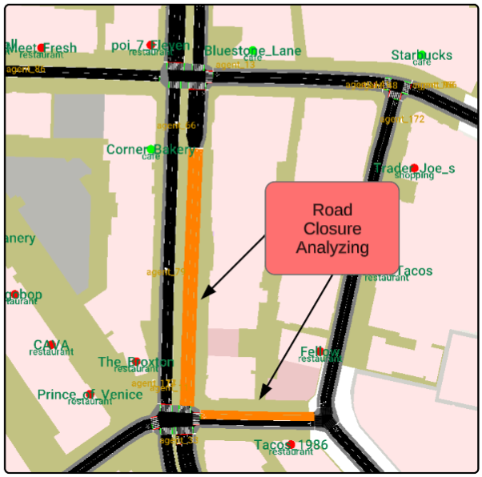

# MobiVerse: Scaling Urban Mobility Simulation with Hybrid Lightweight Domain-Specific Generator and Large Language Models

## Demo Video
[](resources/videos/mobiverse_demo.mp4)

> **Preview Release Notice:** This repository contains a preview version of Mobiverse. The complete codebase will be released following the publication decision of our research paper. The current version demonstrates core functionality while the full system with additional features and comprehensive documentation will be made available upon paper acceptance.

## Overview

MobiVerse is an advanced urban mobility simulation platform that leverages Large Language Models (LLMs) to simulate human mobility decision-making processes. By combining SUMO (Simulation of Urban MObility) with AI-driven behavioral modeling, the system captures how individuals make complex mobility choices in response to dynamic urban environments. Rather than simply modeling traffic flow, MobiVerse focuses on understanding and predicting the decision-making patterns that drive human mobility, incorporating demographic factors, personal preferences, and real-time environmental changes to create realistic agent behaviors.

<div align="center">

</div>

### Key Features
- **Real-time Traffic Simulation**: SUMO-based microscopic traffic modeling
- **LLM-Powered Route Planning**: AI-driven route modifications based on events
- **Interactive Monitoring**: GUI for real-time vehicle tracking and control
- **Dynamic Event Handling**: Road closures, traffic incidents, and rerouting
- **Demographic Modeling**: Agent behavior based on demographic characteristics

### Project Structure
```
mobiverse/
├── westwood_project/           # Main simulation code
│   ├── utilities/             # Core simulation modules
│   ├── data/                  # Generated simulation data
│   ├── runs/                  # Simulation run results
│   ├── poi/                   # Points of Interest data
│   ├── sumo_config/           # SUMO configuration files
│   └── open_ai_api_key.txt    # OpenAI API key (replace with yours)
├── sumo/                      # SUMO installation directory
│   ├── README.md
│   └── sumo/                  # SUMO binaries and tools
└── README.md                  # This file
```

## Use Cases
### 1. Demographic Behavior Study
- **Scenario**: Analyze how agent demographics (age, education, income, work status) influence activity chain modifications in response to environmental changes
- **Steps**: Configure demographic profiles → Introduce environment changes (construction, events, road closures) → LLM generates personalized behavioral responses → Compare adaptation patterns across demographics
- **Applications**: Transportation equity research, demographic-aware urban planning, personalized mobility services

<div align="center">

</div>

<div align="center">
<em>System architecture with an example of a college student reacting to different kinds of environment changes</em>
</div>

### 2. Mobility Pattern Analysis

- **Scenario**: Analyze mobility decision patterns by varying agent density and demographic distribution across different areas
- **Steps**: Configure agent demographics and density in specific zones → Monitor decision-making patterns → Analyze mobility choices and behavioral adaptations
- **Applications**: Urban mobility planning, transportation equity analysis, behavioral pattern recognition

<div align="center">

</div>

<div align="center">
<em>Daily schedule of a student showing mobility decision patterns and activity chains</em>
</div>

### 3. Event-Based Decision Adaptation

- **Scenario**: Simulate how agents adapt their mobility decisions based on real-world events and personal circumstances
- **Steps**: Select agent → Enter event description → LLM generates personalized behavioral response and route modification
- **Applications**: Crisis response planning, event impact assessment, personalized mobility services

<div align="center">

</div>

<div align="center">
<em>Vehicle density heat map at 9:30 am: (a) baseline traffic at 9:30am without event, (b) traffic at 9:30am during the Olympic soccer event</em>
</div>

### 4. Emergency Response Simulation
- **Scenario**: Test evacuation routes and emergency vehicle access
- **Steps**: Create road closures → Monitor agent rerouting → Analyze bottlenecks
- **Applications**: Disaster preparedness, emergency planning

<div align="center">

</div>
<div align="center">
<em>Road closure simulation showing traffic rerouting patterns</em>
</div>

## Installation

### Requirements
- **SUMO**: 1.8.0+
- **Python**: 3.7+
- **OpenAI API Key**: For LLM route modifications
- **System**: 4GB RAM, OpenGL support

### 1. Clone SUMO
```bash
# Clone SUMO into the sumo/ directory
cd sumo/
git clone --recursive https://github.com/eclipse-sumo/sumo.git temp_sumo
mv temp_sumo/* .
mv temp_sumo/.* . 2>/dev/null || true
rmdir temp_sumo
```

### 2. Install Dependencies
```bash
# Install Python packages
pip install sumolib networkx osmium pyproj tkinter openai requests

# Install SUMO (Ubuntu/Debian)
sudo apt-get update
sudo apt-get install sumo sumo-tools sumo-doc

# Set SUMO_HOME environment variable
export SUMO_HOME="/usr/share/sumo"
# Add to ~/.bashrc for persistence
echo 'export SUMO_HOME="/usr/share/sumo"' >> ~/.bashrc
```

### 3. Configure API Key
```bash
# Replace the API key file with your OpenAI API key
echo "your-openai-api-key-here" > westwood_project/open_ai_api_key.txt
```

## QuickStart

### 1. Generate Routes
```bash
cd westwood_project

# Generate agent sequences
python create_routes.py -n 100 --generate-sequences

# Generate SUMO routes with time window
python create_routes.py --start-time 28800 --end-time 43200
```

### 2. Run Simulation
```bash
# Terminal 1: Start SUMO controller
python dynamic_control.py

# Terminal 2: Launch trajectory viewer
python trajectory_viewer.py
```

### 3. Interact with Simulation
1. Click "Connect" in the trajectory viewer
2. Select a vehicle from the dropdown menu
3. Click "Track Agent" to monitor the selected vehicle
4. Use route modification and road closure features as needed

## Customize

### 1. Simulation Map

#### Change Geographic Area
**Location**: `westwood_project/`
```bash
# Download new area data (example: Santa Monica)
wget "https://api.openstreetmap.org/api/0.6/map?bbox=-118.5150,34.0050,-118.4750,34.0350" -O new_area.osm

# Generate new network
netconvert --osm new_area.osm -o new_area.net.xml \
    --geometry.remove \
    --roundabouts.guess \
    --ramps.guess \
    --junctions.join \
    --tls.guess-signals

# Update configuration files
# Edit: westwood.sumocfg -> change net-file to new_area.net.xml
```

#### Modify Network Properties
**Files to edit**:
- `westwood_project/sumo_config/westwood.net.xml`: Road network definition
- `westwood_project/sumo_config/westwood.sumocfg`: Main SUMO configuration

### 2. Activity Chain Generation

The current activity chain generation uses a simple rule-based approach. You can substitute this with your own generation method:

1. **Generate your own agent sequences** using your preferred method (machine learning, survey data, etc.)
2. **Save as JSON format** in `westwood_project/data/agent_sequences.json`:

3. **Generate SUMO routes** from your sequences:
```bash
python create_routes.py --generate-sequences
```

### 3. LLM Prompts and Route Modification

#### Customize Route Modification Prompts
**File**: `westwood_project/utilities/prompt_manager.py`

Modify the prompt templates, event-specific handling, and LLM model parameters to customize how agents respond to different situations and events.

#### Key Customization Areas:
- **Prompt templates**: Main prompt structure for route modification
- **Event types**: Custom event handling (construction, weather, incidents)
- **Model settings**: OpenAI model parameters (model type, temperature, max tokens)

### 4. Visualization and GUI

#### Customize Interface Colors/Layout
**File**: `westwood_project/trajectory_viewer.py`

## System Architecture

<div align="center">

</div>

<div align="center">
<em>System architecture and component relationships</em>
</div>

## Configuration Files

- **`westwood.sumocfg`**: Main SUMO configuration
- **`westwood.net.xml`**: Road network definition  
- **`pois.add.xml`**: Points of Interest
- **`route_info.json`**: Generated routes
- **`matched_pois.json`**: POI data with coordinates

## Troubleshooting

### SUMO Issues
- Ensure `SUMO_HOME` is set correctly
- Check SUMO installation: `sumo --version`

### API Issues
- Confirm valid API key in `open_ai_api_key.txt`
- Check internet connection for LLM requests

### Performance
- Reduce agent count (`-n` parameter) for better performance
- Adjust simulation step length in configuration

## Citation

If you use MobiVerse in your research, please cite our paper:

```bibtex
@article{liu2025mobiverse,
  title={MobiVerse: Scaling Urban Mobility Simulation with Hybrid Lightweight Domain-Specific Generator and Large Language Models},
  author={Liu, Yifan and Liao, Xishun and Ma, Haoxuan and Liu, Jonathan and Jadhav, Rohan and Ma, Jiaqi},
  journal={arXiv preprint arXiv:2506.21784},
  year={2025}
}
```

## License
MIT License - see LICENSE file for details.