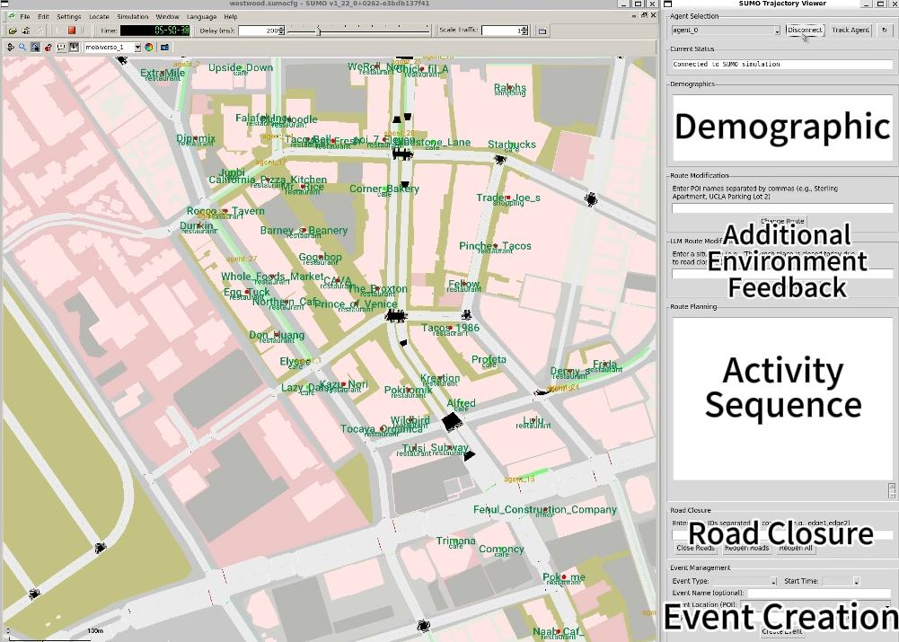

# Mobiverse: LLM-powered Multi-Agent Multimodal Simulation System

## Demo Video
[](resources/videos/mobiverse_demo.mp4)


> **Preview Release Notice:** This repository contains a preview version of Mobiverse. The complete codebase will be released following the publication decision of our research paper. The current version demonstrates core functionality while the full system with additional features and comprehensive documentation will be made available upon paper acceptance.


## Overview
Mobiverse is an intelligent traffic simulation system that combines SUMO (Simulation of Urban MObility) with LLM-powered route planning to simulate and analyze human mobility patterns. The system focuses on the Westwood area of Los Angeles, providing real-time route modification and traffic analysis capabilities.


## System Architecture

### Core Components

1. **SUMO Controller** (`dynamic_control.py`)
   - Manages simulation execution
   - Handles vehicle routing and road closures
   - Processes real-time traffic data
   - Maintains socket communication

2. **Trajectory Viewer** (`trajectory_viewer.py`)
   - GUI for simulation monitoring
   - Real-time vehicle tracking
   - Route modification interface
   - Road closure management

3. **Activity Chain Modifier** (`activity_chain_modifier.py`)
   - LLM-based route modification
   - Traffic pattern analysis
   - Demographic-aware routing
   - Alternative route suggestions

### Key Features

#### Vehicle Management
- Real-time tracking and monitoring
- Dynamic route modification
- Demographic-based behavior modeling
- Automatic rerouting for road closures

#### Traffic Analysis
- Congestion monitoring
- Edge occupancy tracking
- Real-time traffic visualization
- Performance metrics collection

#### Route Planning
- LLM-powered route suggestions
- POI-based navigation
- Traffic-aware routing
- Alternative route generation

## Setup Instructions

### Prerequisites

1. **Software Requirements**
   - SUMO (version 1.8.0+)
   - Python 3.7+
   - Required packages:
     ```bash
     pip3 install sumolib networkx osmium pyproj requests numpy traci
     ```

2. **System Requirements**
   - OS: Linux, Windows, or macOS
   - RAM: 4GB minimum
   - Graphics: OpenGL support

### Installation Steps

1. Clone the repository and `cd` into the `westwood_project/` folder.
   ```bash
   git clone https://github.com/bmmliu/mobiverse
   cd mobiverse
   cd westwood_project
   ```

2. **Download Map Data**
   ```bash
   wget "https://api.openstreetmap.org/api/0.6/map?bbox=-118.4550,34.0550,-118.4350,34.0750" -O westwood.osm
   ```

3. **Generate Network**
   ```bash
   netconvert --osm westwood.osm -o westwood.net.xml \
       --geometry.remove \
       --roundabouts.guess \
       --ramps.guess \
       --junctions.join \
       --tls.guess-signals \
       --tls.discard-simple \
       --tls.join \
       --geometry.max-grade.fix \
       --sidewalks.guess \
       --crossings.guess \
       --junctions.corner-detail 5 \
       --keep-edges.by-vclass passenger \
       --remove-edges.by-vclass pedestrian,bicycle \
       --keep-edges.components 1
   ```

   **Note**: The `--keep-edges.by-vclass passenger` and `--remove-edges.by-vclass pedestrian,bicycle` options ensure that only edges accessible to passenger vehicles are included in the network. This is crucial for proper route generation. The `--keep-edges.components 1` option keeps only the largest connected component of the network.

4. **Process POIs and Landscape**

To create a complete list of points of interest (POIs), we extract POIs from OpenStreetMap's Overpass API and convert them to the SUMO POI format using the `download_and_convert_pois.py` script.

The script extracts the following types of POIs:

- **Amenities**:
  - Restaurants
  - Cafes
  - Schools
  - Parking

- **Shops**:
  - Various types of shops

- **Offices**:
  - Office buildings

- **Entertainment Venues**:
  - Entertainment venues such as cinemas, theatres, and arts centres

To run the script, use the following command in your terminal:

```bash
python download_and_convert_pois.py --south <south_latitude> --west <west_longitude> --north <north_latitude> --east <east_longitude> --net <path_to_sumo_network_file> --output <output_file>
```

- **Parameters**:
   - `--south`: Southern latitude boundary (float, required)
   - `--west`: Western longitude boundary (float, required)
   - `--north`: Northern latitude boundary (float, required)
   - `--east`: Eastern longitude boundary (float, required)
   - `--net`: Path to the SUMO network file (e.g., `westwood.net.xml`, required)
   - `--output`: Output file name for the SUMO POI data (default: `pois.add.xml`)

To obtain POIs in the Westwood neighborhood and the UCLA area, you would run:

```bash
python download_and_convert_pois.py --south 34.0550 --west -118.4550 --north 34.0750 --east -118.4350 --net westwood.net.xml --output pois.add.xml
```

This saves a list of POIs in an XML file called `pois.add.xml` that is read by the `dynamic_control.py` program.

5. **Load in your OpenAI API Key**

Create a new file in `westwood_project/` called `open_ai_api_key.txt` and paste in your OpenAI API key here.

## Usage Guide

### 1. Route Generation

#### Generate Agent Sequences
```bash
python create_routes.py -n 1000 --generate-sequences
```
Options:
- `-n, --num-agents`: Number of agents (default: 100)
- `--generate-sequences`: Create new agent sequences

#### Generate SUMO Routes
```bash
python create_routes.py --start-time 21000 --end-time 86400
```
Options:
- `--start-time`: Start time in seconds (default: 8:00 AM)
- `--end-time`: End time in seconds (default: 12:00 PM)

### 2. Running the Simulation

1. **Start SUMO Controller**
   ```bash
   python3 dynamic_control.py
   ```

2. **Launch Trajectory Viewer**
   ```bash
   python3 trajectory_viewer.py
   ```

3. **Connect and Monitor**
   - Click "Connect" in the viewer
   - Select a vehicle from the dropdown
   - Click "Track Agent" to monitor

### 3. Interactive Features

#### Vehicle Tracking
- Real-time position and speed monitoring
- Route visualization
- Demographics display
- POI visit tracking

#### Route Modification
1. Select vehicle to modify
2. Enter new POI sequence
3. Click "Change Route"

#### Road Closures
1. Enter edge IDs
2. Use "Close Roads" to block segments
3. "Reopen Roads" or "Reopen All" to restore

## Technical Details

### Coordinate Systems

1. **SUMO Network Coordinates (x,y)**
   - Relative coordinates in meters
   - Origin at (0,0)
   - Conversion boundary: (0.00,0.00) to (2995.27,3060.50)

2. **UTM Coordinates**
   - Network offset: (-365398.86, -3768588.46)
   - Zone: 11N (Los Angeles)

3. **Geographic Coordinates (lat/lon)**
   - Boundary: (-118.473407,34.025616) to (-118.416791,34.082241)

### Configuration Files
- `westwood.sumocfg`: SUMO configuration
- `pois.add.xml`: Points of Interest
- `route_info.json`: Base routes
- `route_info_road_closures.json`: Modified routes
- `matched_pois.json`: POI data

### Performance Optimization
- Selective data transmission
- Efficient message buffering
- Non-blocking socket operations
- Thread-safe GUI updates

### ETA Calculation

When a route is modified with an LLM, the ETA information is passed into the LLM to have it determine the best way to reroute the activity chain. This is done to model the decision to change one's plans depending on heavy traffic.

The ETA is calculated by using TraCI to retrieve the route to the target POI from the agent's current position. The average speed/flow rate for each non-internal edge on the route, and the time to travel this edge (in seconds) is calculated using the length of the edge. If no vehicles travelled on the edge during the calculation, then the calculation falls back to the speed limit of the edge. The time to travel each edge is then added up to determine the total ETA.

This ETA is then compared to the no-traffic and freeflow ETA, which is calculated without considering any current congestion conditions for each edge. Instead, it assumes the car is able to travel at the speed limit for each edge, and the speed limit is used for the time calculations.  The time to travel each edge is then added up to determine the total no-traffic ETA.

Both the no-traffic ETA and the ETA factoring in current conditions is then fed into the LLM, which determines how the activity chain should be modified depending on how much congestion conditions cause the two ETAs to differ.

## API Reference

### Core Classes

#### `SUMOController`
*File: `dynamic_control.py`*

The main orchestrator for the simulation. Handles SUMO execution, vehicle routing, road closures, event creation, socket communication, and coordinates all other handler classes.

- **Key Methods:**
  - `start_simulation()`: Runs the simulation loop, processes vehicles, and handles viewer commands.
  - `change_agent_route(agent_id, new_poi_sequence, durations)`: Updates an agent's route in SUMO.
  - `handle_road_closure(edge_ids)`: Closes roads and triggers rerouting for affected agents.
  - `handle_event_creation(event_data)`: Handles new events and updates agent activity chains.
  - `calculate_eta_to_poi(vehicle_id, target_edge)`: Computes ETA to a POI with and without traffic.

---

#### `ActivityChainModifier`
*File: `activity_chain_modifier.py`*

Handles LLM-based modification of agent activity chains, including POI and route data loading, distance calculations, and parallel LLM calls.

- **Key Methods:**
  - `modify_activity_chain_with_llm(...)`: Calls the LLM to generate a new activity chain for an agent.
  - `modify_activity_chains_parallel(agent_data_list)`: Processes multiple agents in parallel.
  - `load_pois()`, `load_route_info()`: Load POI and route data from files.
  - `get_poi_by_name(name)`, `find_nearest_poi(lat, lon)`: POI lookup utilities.

---

#### `EventHandler`
*File: `event_handler.py`*

Models agent interest in events, selects attendees, and coordinates event insertion into activity chains via the LLM.

- **Key Methods:**
  - `calculate_interest_score(agent, event)`: Computes an agent's interest in an event.
  - `select_interested_agents(agents, event, capacity)`: Selects top agents for an event.
  - `handle_affected_agents(agents, event, activity_modifier, prompt)`: Modifies agent chains to include the event.

---

#### `PromptManager`
*File: `prompt_manager.py`*

Generates natural-language prompts for LLMs, tailored to road closures, event creation, and route modifications.

- **Key Methods:**
  - `road_closure_prompt(closed_edges, affected_pois, alternatives)`: Prompt for road closure rerouting.
  - `event_creation_prompt(event_data, agent_demographics)`: Prompt for inserting an event.
  - `route_modification_prompt(current_chain, situation, traffic_info)`: Prompt for general route changes.

---

#### `RoadClosureHandler`
*File: `road_closure_handler.py`*

Manages dynamic road closures, tracks affected POIs, finds nearby alternatives, and identifies/handles affected agents.

- **Key Methods:**
  - `close_roads(edge_ids)`, `reopen_roads(edge_ids)`: Manage road closures in SUMO.
  - `find_nearby_pois(edge_id, max_distance)`: Finds POIs near a closed edge.
  - `find_affected_agents(route_info, affected_pois, closed_edges, current_vehicles)`: Identifies agents impacted by closures.
  - `handle_affected_agents(...)`: Orchestrates rerouting for affected agents.

---

#### `TrajectoryViewer`
*File: `trajectory_viewer.py`*

Provides a GUI for simulation monitoring, real-time vehicle tracking, and interactive route/road closure management.

- **Key Features:**
  - Real-time vehicle and route visualization.
  - Interactive road closure and rerouting controls.
  - Demographics and POI visit display.

---

**See the `docs/` directory for full class and method documentation.**

## Troubleshooting

### Common Issues

1. **POI Display Problems**
   - Check POI extraction settings
   - Verify name handling
   - Adjust POI spacing

2. **Route Generation Issues**
   - Verify edge connectivity
   - Check vehicle type settings
   - Confirm road permissions

3. **Performance Issues**
   - Adjust step length
   - Modify update frequency
   - Optimize vehicle count

## Contributing
Contributions are welcome! Please feel free to submit issues and enhancement requests.